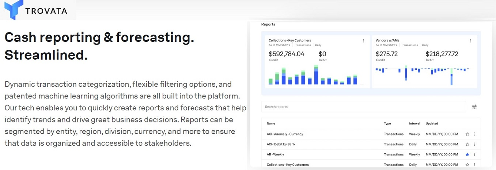

# Module 1 Homework (Fintech)

# Case Study: Trovata - a company addressing global 'Multi-Banking' challenges via Open Banking and Machine Learning.
Recent developments in Open Banking interfaces and the arrival of some financial consolidator apps/fintechs (such as Plaid, Yodlee and Klarna) have made it possible for clients with multiple banking relationships to service all of their regular banking needs (such as Payment Initiation, Account Balances & Transaction Reporting and/or Data Analytics) via a single electronic channel/portal. Note that this is already a well-accepted and well-established offering in Europe (enabled mostly due to regulatory mandates such as the 'Second Payment Services Directive' i.e., PSD2 across Europe, which standardized Open Banking requests for Payment Initiation and Account Reporting across the banks operating in the region). In the US there currently is no comparable initiative from the banking community/regulator for standardization across banks, however the availability of Open Banking/API from most of these banks in the last few years has enabled several tech organizations (such as the aforementioned Plaid and Yodlee) to build interfaces to several banks and offer these connectivity solutions to businesses (i.e. other Fintechs) that may then supplement that with their own direct connectivity options and consolidate all of that data to create even more-value-added services such as Data Visualizations, Cash Forecasting, etc.

One of the pioneers and the most successful fintechs in this space is **Trovata**, and that is company that I have chosen to build a case-study on. 

Trovata took on the task of - and successfully managed to - come up with a single-banking channel portal, harnessing latest developments in Open Banking, Machine Learning, and also the _ _inherent_ _ limitations in the individual banks' current Cash Management offerings to build a solution that allowed clients to consolidate, view and manage multiple banking accounts through a single interface,  making it easier for these businesses to see the full picture of all their finances across the various regions/banks that they operate in/deal with!  The value-added features made available by Trovata is automated cash reporting, cash forecasting, financial analysis, and money movement, helping companies gain powerful insights into their cash flows and facilitate better and quicker business decisions.

## Overview and Origin
Trovata was incorporated in the year **2016** and is headquartered in San Diego, California, USA.

Trovata has a total 8 investors with the larger investments coming from Capital One Ventures, Pivot Investment Partners, J.P. Morgan Chase & Co, Wells Fargo Strategic Capital and NAB Ventures. Till date Trovata has raised a total of US $57.6M from 7 rounds of funding, with the latest funding round (Series B) completed on 7th June, 2022. One of the unique things about this Fintech is that some of the major backers of this firm are the same entities that it aims to disrupt i.e. Banks. However some of the largest banks such as J.P. Morgan Chase and Wells-Fargo have realized that they are not technology companies, choosing instead to invest in Trovata while focusing primarily on their core banking strengths and leveraging the specific strengths of a tech-savvy Fintech such as Trovata. 

Some of the problems faced by large businesses, especially the ones with multiple banking relationships with operations in multiple locations throughout the globe are: 

  (1) Differences in the Balance & Transaction Reporting capabilities between banks, thereby adding inefficiencies into the client's Account Balancing and Cash Concentration processes.

  (2) Data mismatch/disparities between the client's ERP/Treasury Systems, account reporting from their banks and internal AP/AR Teams, thereby reducing the quality of the client's Cash Forecasts for Liquidity Planning.

  (3) Differences between the Payment Initiation capabilities between banking providers forcing clients to build, maintain, monitor and frequently upgrade your custom connectivity with each Bank across the markets that they operate in.

Trovata's core pitch to clients is a consolidated Open Banking platform that directly connects to various banks to aggregate transaction data into a single platform/channel for their clients. This makes it easy for businesses to automate cash reporting, forecasting, and analysis. By bridging the gap between banks and clients' internal GL accounting/ERP systems, Trovata is helping companies gain powerful insights into their cashflows that drive better and quicker business decisions and helping companies transform finance and treasury operations.

Trovata at its heart is a data platform that automates cash workflows with no major technology work required to set up. Without Trovata, a solution of this scale and complexity would take corporations months to set up on their own, and that too with significant investments in their own technology resources. For businesses, Trovata makes managing cash easier by automating much of the work it takes to prepare reports and forecasts that are essential to understand cashflow and make decisions to maintain or improve the financial health of the client's business. They also help users make payments from their banks’ payment rails directly with no third-party intermediary.

Trovata aims to help businesses throughout the world freely manage cash – free from data access constraints, free from a reliance on spreadsheets, free from having to hire more people to do manual work for these functions as the business scales.

### Management Team: 
The company was founded in 2016 by **Brett Turner**. Brett has had more than 20 years of experience in finance at both public and private high-growth companies (CPA at Deloitte; Finance Controller roles in various firms; SEC Reporting at Amazon; and CFO of three tech startups since 2005). He leveraged his ringside view of the Cash & Reporting problems faced by his erstwhile Treasury and Accounting teams and also foresaw the transformation of enterprise technology by SAAS and Cloud Computing and translated all of that into Trovata's core offering. He very much is still associated with Trovata and continues to serve as CEO of firm. The other core members of the management team are **Joseph Drambarean (CTO)** and **Scott Harrington (CFO)**.

## Business Activities
Critical business decisions that hitherto would have meant days/weeks of manual cash processes by clients is reduced by the centralization and digitization of all the various touchpoints across several banks. Traditionally, 90% of a Corporate Treasury/Cash Management team's work is preparing spreadsheets and charts, and only 10% is communicating what the data means for business leaders i.e., the ones who are responsible for making the larger business decisions. Trovata aims to flip that so that 90% is automated, and Treasury, Finance & Accounting teams have more time for analysis that feeds faster decision-making. By digitizing the client's treasury operations and data management with reporting and forecasting best practices in mind, these teams can gain global visibility into their finances. Trovata then provides actionable tips to analyze, report, and forecast cash faster and more accurately.

The ideal client for Trovata is one that has several banking relationships and/or may be a multinational corporation operating in several countries across the globe.

In the US, Trovata has the first-mover advantage - it currently has more than 50 Corporate and over 2,000 Open Banking APIs globally that it has developed (and has been in live production!) over the past 5 years. In addition, they leverage Machine Learning for some of the value-added services such as Cashflow Forecasting.

## Landscape
Due to increased globalization, business operations - in additional to supply chain dynamics - have become complex. Companies operate in several countries and are forced to have several banking relationships (e.g., a client with operations in China required to maintain accounts with local, in-country banks). The holy grail is to have a single window into all this complexity at least from a banking/financial point of view.

Two of the hottest topics right now in the banking world and among Corporates are 'Open Finance' and 'Open APIs' (aka Open Banking). Trovata provides both in a single platform: They connect to Bank APIs to aggregate balances and transactions and standardize that data across all banks globally to power an entirely new user experience for businesses to manage cash. Trovata lets finance and treasury teams access, build, manage, and control all of their financial data – from Banks, Business & Accounting systems, and external markets – connecting to these sources in near real-time. This helps clients drive efficiencies through ease of access to data, enriched data visualization and workflow automation.

## Results
The business impact of Trovata thus far has been significant since its inception just slightly over 5 years ago. The most important metrics to measure companies in this domain include connectivity, number of clients/users, and revenue generated, and Trovata excels in all of the metrics.

While Trovata has had first mover advantage in the US, there are possible global competitors on the horizon such as Braintree, ErisX, Paystack and ContaAzul. In addition, there are smaller but well-established local/region-specific competitors in Asia (Liquidice, India) and EMEA (Multicash, Germany), as also the global ERP and TMS providers such as SAP and Oracle Applications, all of whom either already have similar products, or are in the process of developing solutions similar to that from Trovata.

In their own words, Trovata is... 
> "Building the future of Cash Management!"

## Recommendations
Trovata's management is doing great and indeed has the right ideas to expand their business. If anything I would advise Trovata to expand faster into the regions. They have a great US-centric offering but their larger clients typically havea global footprint and require a truly global offering. Trovata does seem to understand/acknowledge this; in fact, their latest Series-B funding _ _pitch_ _ was precisely that - to extend their global reach to include the UK, EU and Australia. In my view, Trovata needs to move quickly into Asia where there are already several Fintechs building comparable solutions.

Another idea is launch a _ _freemium_ _ version of Trovata with rapid self-onboarding and access to rich services that can be tailored for - and potentially be billed to - businesses as needed on demand.

Trovata will need to constantly be alert to evolving markets trends (such as the ongoing prevalance of Real-time/Mobile/Wallet Payments in several countries), ever-ongoing expansion of API availability from business partners and complex bank reconciliation requirements as clients business complexities grow.

## References:
[Trovata Official Site](https://trovata.io/)
